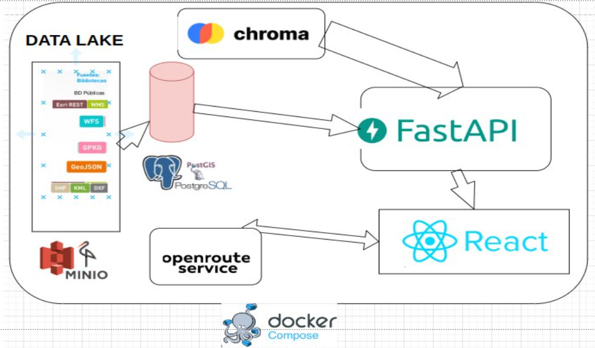
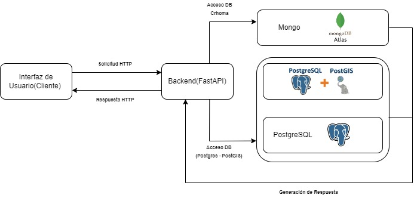

# proyecto_biblo

# RED DE BIBLIOTECAS: UNA APUESTA A LA CONEXIÓN

Gutiérrez Verano Katherin Alexandra, Castillo López Gonzalo, Poveda Girata Hugo Steven, Silva Piracoca Edwin Leonardo

{kagutierrez, g.castillol, H.Poveda, e.silva}@javeriana.edu.co

Pontificia Universidad Javeriana

Bogotá D.C.

---

## Introducción

### Resumen
Acceder a las fuentes de conocimiento ofrecidas por las bibliotecas en Bogotá puede representar un desafío, dado que no siempre se dispone de información precisa sobre la existencia de un libro o documento en una biblioteca específica, ni sobre su ubicación geoespacial. Para abordar esta necesidad, el presente documento propone una solución tecnológica que, mediante la integración de datos en diferentes formatos, permite ubicar geo-espacialmente las bibliotecas más cercanas al usuario. Esto brinda la oportunidad de identificar fácilmente la biblioteca más próxima o la que más convenga según su ubicación actual.

### Palabras claves
BD Geoespacial, BD Vectoriales, BD Relacional, Docker.

### Contexto y Alcance
La innovación tecnológica beneficiada por ecosistemas de datos abiertos ha permitido la creación de soluciones y productos que responden a necesidades públicas. Estas soluciones han integrado datos de diversos formatos y, dependiendo de los casos de negocio, han utilizado diferentes bases de datos, basados en la consistencia y disponibilidad de los datos. La iteración entre datos heterogéneos con bases de datos de diferentes fuentes ha permitido el desarrollo de proyectos de integración de datos, iniciando con la comprensión de la información almacenada, con una posterior definición de mecanismos que permitan el flujo de datos entre sistemas y la implementación de cambios de estructuras. De este proceso se obtiene información transformada para formar parte de una fuente de información, como un DWH, o presentada al usuario final como resultado de una consulta.

En este entorno de datos y ecosistemas de aplicaciones, tenemos APIS que permiten extraer datos públicos, o aplicaciones APP diseñadas para solucionar necesidades de usuarios en el comercio, educación, salud o sector financiero, con la oportunidad permanente de crear nuevas soluciones que permitan atender necesidades públicas. Este documento presenta una solución que brinda la posibilidad a los usuarios de bibliotecas de ubicar geoespacialmente la más cercana a su ubicación.

El acceso a las bibliotecas es fundamental para el uso cotidiano y su utilización como espacios de encuentro social y convivencia ciudadana. Son la unidad de información más cercana a la comunidad. En el presente proyecto se presentan los datos no solo de bibliotecas públicas de la ciudad de Bogotá, sino también bibliotecas comunitarias, BibloRed, Manzanas del Cuidado, BibloEstación y Hemerotecas de la ciudad, como espacios que tienen desafíos a la accesibilidad por el desconocimiento del público de su ubicación o de la información que en ellas se puede encontrar.

Las bibliotecas tienen servicios de búsqueda de libros digitales y físicos, consulta de tesis y proyectos de investigación, y ofrecen servicios de educación continua que involucran a estudiantes y a la comunidad. Por ello, son centros de oportunidad para el aprendizaje y de avance para personas interesadas en lectura e investigación que no pueden comprar todas las publicaciones buscadas.

En el presente proyecto se busca conectar las bibliotecas en una aplicación tecnológica a través de los datos públicos ofrecidos por la página de Datos Abiertos de Bogotá, con las herramientas de bases de datos relacionales como PostgreSQL y bases de datos geoespaciales como PostGIS. Se busca analizar la relación entre los datos de las diferentes bibliotecas, la accesibilidad geográfica, la cobertura de libros manejados, y la información de contacto que brindan, por medio de Docker Compose.


## Objetivos

### Objetivos Generales
- **Desarrollar una solución tecnológica integral** que permita a los usuarios localizar geo-espacialmente las bibliotecas más cercanas en la ciudad de Bogotá, mejorando el acceso a la información bibliográfica y geoespacial mediante el uso de datos abiertos y diversas herramientas tecnológicas.

### Objetivos Específicos

1. **Recopilación y Almacenaje de Datos**
   - Recopilar y procesar datos de diversas fuentes públicas. Estos datos serán gestionados y almacenados utilizando MinIO. Adicionalmente, se configurarán bases de datos relacionales, geoespaciales y vectoriales, ejecutadas y orquestadas dentro de Docker Compose para asegurar una ejecución coordinada y eficiente de los componentes del sistema.

2. **Desarrollo e Implementación Tecnológica**
   - Desarrollar e implementar la tecnología necesaria para la explotación de los datos. Se crearán APIs utilizando FastAPI para exponer los datos de manera eficiente y segura, y se implementará una interfaz de usuario con Streamlit que permitirá la visualización intuitiva de la información geoespacial. Se llevarán a cabo pruebas de integración y funcionamiento para asegurar la eficiencia y efectividad del sistema.

3. **Facilitación del Acceso a Información Bibliotecaria**
   - Facilitar el acceso a la información bibliotecaria, permitiendo a los usuarios consultar la ubicación de las bibliotecas más cercanas, incluyendo bibliotecas públicas, comunitarias, Biblored y Manzanas del Cuidado. Se proveerá una herramienta que facilite el acceso y el conocimiento público sobre los servicios bibliotecarios disponibles en Bogotá, mejorando así la accesibilidad y promoviendo la utilización de estos recursos valiosos para la comunidad.

## Atributos de Calidad

La calidad es fundamental en el desarrollo exitoso del aplicativo, garantizando una experiencia de usuario óptima, segura y confiable.

### Escalabilidad

- **Escalabilidad Horizontal**: La aplicación está diseñada para manejar un incremento en la cantidad de usuarios y datos distribuyendo la carga en múltiples servidores. Para manejar un aumento en la carga de trabajo, se utilizarán servicios en la nube para almacenar y procesar datos, permitiendo escalar horizontalmente agregando más instancias de servidores según sea necesario.

### Rendimiento

El tiempo de respuesta de la aplicación es crucial para proporcionar una experiencia fluida y eficiente al localizar las bibliotecas cercanas rápidamente. Como estrategias, se plantea:

- Utilización de técnicas de cacheo para almacenar temporalmente datos frecuentemente accedidos, reduciendo el tiempo de acceso.
- Optimización de consultas a la base de datos relacional para mejorar la rapidez en la recuperación de información.

### Disponibilidad

La aplicación estará disponible y operativa la mayor parte del tiempo, con mínimos tiempos de inactividad. Se implementará:

- Monitoreo continuo y alertas para detectar y resolver problemas rápidamente.

### Seguridad

Para garantizar la seguridad de los datos y la aplicación:

- No se almacenarán datos sensibles del usuario.
- Se usarán protocolos que permitan la autenticación segura y protejan las API de acceso a datos.
- Se implementará HTTPS para todas las comunicaciones entre el cliente y el servidor.

### Mantenibilidad

El código de la aplicación estará estructurado de manera que sea fácil de entender y modificar. Se incluirá:

- Documentación clara y detallada para facilitar futuras modificaciones y actualizaciones.
- La aplicación estará dividida en componentes pequeños y reutilizables, facilitando las actualizaciones y el mantenimiento.

### Confiabilidad

Se asegurará que los datos presentados sean correctos y coherentes, sin errores ni duplicados. Para ello:

- Se realizarán pruebas unitarias y de integración para garantizar que nuevas actualizaciones no introduzcan errores.
- Se mantendrán bases de datos replicadas y backups automáticos para prevenir pérdida de datos.


## Descripción de la Arquitectura

La arquitectura del sistema está diseñada para permitir a los usuarios localizar geo-espacialmente las bibliotecas más cercanas en Bogotá, integrando diversas fuentes de datos y utilizando herramientas tecnológicas avanzadas. Los datos son recolectados desde fuentes públicas en múltiples formatos (Esri REST, WMS, WFS, GPKG, GeoJSON, SHP, KML, DXF) y gestionados mediante MinIO. Estos datos se almacenan en bases de datos relacionales, geoespaciales y vectoriales, que son orquestadas y gestionadas con Docker Compose. La capa de presentación incluye APIs desarrolladas con FastAPI y una interfaz de usuario intuitiva creada con Streamlit, complementada con búsqueda semántica en bases de datos documentales.

### Diagrama de Arquitectura

El diagrama de arquitectura muestra la estructura del ecosistema, destacando los componentes principales y su interconexión.



### Componentes

#### Fuentes de Datos y Bibliotecas (ETL - Ingesta)
- **MinIO**: Un sistema de almacenamiento distribuido utilizado para gestionar y almacenar grandes volúmenes de datos recolectados. Almacena archivos en formatos Esri REST, WMS, WFS, GPKG, GeoJSON, SHP, KML, DXF, los cuales son diferentes formatos de datos geoespaciales y bibliográficos recolectados desde diversas fuentes públicas.

#### Sistema de Almacenaje de Información
- **BD Relacional**: PostgreSQL almacena datos estructurados en un formato relacional, proporcionando una base sólida y robusta para la gestión de datos en libros y bibliotecas.
- **BD Geoespacial**: PostGIS, como extensión de PostgreSQL, maneja datos geoespaciales necesarios para la localización precisa de las bibliotecas, permitiendo consultas y análisis espaciales avanzados.
- **BD Vectorial**: PostgreSQL también almacena datos vectoriales utilizados para representar objetos en un espacio geográfico, facilitando el manejo y análisis de datos vectoriales.
- **BD Documental**: MongoDB, una base de datos de documentos que ofrece gran escalabilidad y flexibilidad, y un modelo de consultas e indexación avanzado. Como ejercicio académico y complemento en el desarrollo del proyecto, el aplicativo se conecta a MongoDB para búsquedas semánticas.
- **Docker Compose**: Orquestador de contenedores utilizado para desplegar y gestionar los distintos componentes del sistema, asegurando su ejecución coordinada y eficiente.

#### Presentación
- **FastAPI**: Utilizado para desarrollar APIs que exponen los datos de manera eficiente y segura, facilitando la interacción con los datos almacenados y proporcionando un acceso rápido y estructurado a la información.
- **React**: Librerías de JavaScript utilizada en el desarrollo de la aplicación. 


### Flujo de Datos

El diagrama de flujo muestra el movimiento de datos desde las fuentes hasta la presentación final al usuario.



## Tecnologías Utilizadas

- **MinIO**: Utilizado para gestionar y almacenar grandes volúmenes de datos en diversos formatos.

- **PostgreSQL**: Base de datos relacional utilizada para almacenar datos estructurados.

- **PostGIS**: Extensión de PostgreSQL para manejar datos geoespaciales.

- **Docker Compose**: Orquestador de contenedores utilizado para la implementación y gestión coordinada de los componentes.

- **FastAPI**: Framework para el desarrollo de APIs eficientes y seguras.

- **React**: Biblioteca de JavaScript para desarrollar interfaces de usuario intuitivas y dinámicas.

- **MongoDB**: Base de datos documental de fácil y rápida indexación, muy eficiente en procesos de búsquedas semánticas. Como valor agregado al proyecto, se realiza a través del front una búsqueda de palabras existentes en la base de datos de MongoDB.

- **Python**: Lenguaje de programación utilizado para el desarrollo del backend y procesamiento de datos.

- **Java**: Lenguaje de programación utilizado para la implementación de algunos servicios backend.

- **SQL**: Lenguaje de consulta utilizado para interactuar con bases de datos relacionales.

- **NoSQL**: Modelo de base de datos utilizado para almacenar datos no estructurados y de fácil escalabilidad.

## Configuración e Instalación

### MinIO

1. **Instalar Docker**:
   - Asegúrate de tener Docker instalado en el sistema. Puedes instalar Docker desde [Docker Hub](https://hub.docker.com/) o manejarlo mediante Visual Studio Code.

2. **Descargar la imagen de MinIO**:
   - Usa el siguiente comando para descargar la imagen de MinIO:
     ```bash
     docker pull minio/minio
     ```

3. **Configurar y ejecutar MinIO**:
   - Configura MinIO con credenciales personalizadas y ejecuta el contenedor:
     ```bash
     docker run -p 9000:9000 --name minio \
       -e "MINIO_ACCESS_KEY=youraccesskey" \
       -e "MINIO_SECRET_KEY=yoursecretkey" \
       minio/minio server /data
     ```

### PostgreSQL con PostGIS

1. **Descargar la imagen de PostgreSQL con PostGIS**:
   - Usa el siguiente comando para descargar la imagen de PostgreSQL con PostGIS:
     ```bash
     docker pull postgis/postgis
     ```

2. **Configurar y ejecutar PostgreSQL con PostGIS**:
   - Configura PostgreSQL con credenciales personalizadas y ejecuta el contenedor:
     ```bash
     docker run -p 5432:5432 --name postgis \
       -e POSTGRES_USER=yourusername \
       -e POSTGRES_PASSWORD=yourpassword \
       postgis/postgis
     ```

3. **Acceder a PostgreSQL con PostGIS**:
   - Utiliza un cliente o herramienta gráfica como pgAdmin para acceder a PostgreSQL con PostGIS.

### Docker Compose

1. **Crear un archivo `docker-compose.yml`**:
   - Crea un archivo `docker-compose.yml` con la configuración de los servicios necesarios:
     ```yaml
     version: '3.8'
     services:
       minio:
         image: minio/minio
         ports:
           - "9000:9000"
         environment:
           MINIO_ACCESS_KEY: youraccesskey
           MINIO_SECRET_KEY: yoursecretkey
         command: server /data

       postgis:
         image: postgis/postgis
         ports:
           - "5432:5432"
         environment:
           POSTGRES_USER: yourusername
           POSTGRES_PASSWORD: yourpassword
     ```

2. **Ejecutar Docker Compose**:
   - Ejecuta el siguiente comando en la terminal para iniciar los servicios definidos en `docker-compose.yml`:
     ```bash
     docker-compose up -d
     ```

### FastAPI

1. **Instalar FastAPI**:
   - Usa pip para instalar FastAPI y Uvicorn:
     ```bash
     pip install fastapi uvicorn
     ```

2. **Crear una aplicación FastAPI**:
   - Crea un archivo `main.py` y define tu aplicación FastAPI:
     ```python
     from fastapi import FastAPI

     app = FastAPI()

     @app.get("/")
     def read_root():
         return {"Hello": "World"}

     if __name__ == "__main__":
         import uvicorn
         uvicorn.run(app, host="0.0.0.0", port=8000)
     ```

3. **Ejecutar la aplicación FastAPI**:
   - Ejecuta el siguiente comando para iniciar el servidor de desarrollo:
     ```bash
     uvicorn main:app --reload
     ```

### React

1. **Instalar Node.js y npm**:
   - Asegúrate de tener Node.js y npm instalados en tu sistema. Puedes descargarlos desde [Node.js](https://nodejs.org/).

2. **Crear una aplicación React**:
   - Usa el siguiente comando para crear una nueva aplicación React:
     ```bash
     npx create-react-app my-app
     ```

3. **Iniciar la aplicación React**:
   - Navega al directorio de tu aplicación y ejecuta el servidor de desarrollo:
     ```bash
     cd my-app
     npm start
     ```
Siguiendo estos pasos, habrás configurado y ejecutado los componentes principales de tu aplicación, incluyendo MinIO, PostgreSQL con PostGIS, Docker Compose, FastAPI y React. Asegúrate de personalizar las credenciales y configuraciones según tus necesidades específicas.

## Uso del Proyecto

Las bibliotecas desempeñan un papel fundamental en la búsqueda y divulgación del conocimiento, ya que los servicios ofrecidos permiten aprender, apoyar la alfabetización y educación en la sociedad. Sin embargo, muy pocas personas hacen uso de estos espacios debido al avance en la accesibilidad en formato digital de la información, o por falta de conocimiento de los servicios disponibles en estos espacios.

El acceso al conocimiento es esencial para el desarrollo personal y profesional de estudiantes y de toda la comunidad. A veces, encontrar una biblioteca cercana que brinde los recursos necesarios es un desafío, no solo por la distancia sino también por la falta de claridad sobre los servicios que ofrece.

La aplicación tecnológica descrita en este proyecto permite ubicar la biblioteca más cercana a la ubicación del usuario de manera rápida y sencilla, facilitando el acceso a esas fuentes de información disponibles en las bibliotecas seleccionadas. Esto se logra mediante el uso de tres bases de datos, una aplicación cliente y, si se desea, una capa de API Rest para ser consumida. La implementación se desarrolla utilizando Docker Compose.

### Justificación de la Tecnología Utilizada

El proyecto utiliza una combinación de tecnologías avanzadas para proporcionar una solución robusta y eficiente que facilita el acceso a la información bibliográfica y geoespacial. Mediante el uso de MinIO, PostgreSQL con PostGIS, Mongo y Docker Compose, se asegura que los datos sean gestionados de manera eficiente y accesible, mientras que el uso de tecnologías de código abierto garantiza la seguridad y la colaboración en el desarrollo del sistema.

#### MinIO
Para el almacenamiento de los datos se utiliza MinIO porque es ideal para grandes cantidades de datos no estructurados, como archivos multimedia, copias de seguridad, archivos de log y otros tipos de datos binarios. MinIO proporciona una API compatible con S3, lo que facilita la integración con otras herramientas y servicios que ya utilizan este estándar. Además, se elige MinIO en vez de MongoDB porque su gestión no requiere la creación y mantenimiento de índices complejos, ya que se enfoca en el almacenamiento de objetos.

#### PostgreSQL con PostGIS
Para las bases de datos geoespaciales se utiliza PostgreSQL debido a su capacidad de manejar grandes volúmenes de datos y su optimización de consultas. PostGIS, como extensión de PostgreSQL, permite almacenar y consultar datos espaciales de manera eficiente e incluye tipos de datos geométricos para que el cliente pueda tener un polígono de las bibliotecas más cercanas a su localización. El uso de PostgreSQL con PostGIS proporciona una solución robusta, eficiente y flexible para el proyecto.

#### Docker Compose
Para la gestión de los entornos de las bases de datos se utiliza Docker Compose, que permite orquestar varios contenedores de manera independiente, sin generar conflictos entre ellos. Esto permite que el archivo se pueda ejecutar por parte del desarrollador en cualquier máquina que tenga Docker instalado, facilitando la colaboración y el despliegue.

#### Tecnologías de Código Abierto
El uso de tecnologías de código abierto y gratuitas reduce costos de licenciamiento y permite auditar el código y contribuir a su desarrollo, mejorando la seguridad y la confiabilidad del sistema.

## Pruebas y Validación

### Estrategia de Pruebas

En el desarrollo del aplicativo, como estrategia de pruebas y validación, se realizarán las siguientes actividades:

- **Pruebas Unitarias**: Verificar el correcto funcionamiento de componentes individuales de la aplicación.
- **Pruebas Funcionales**: Validar que la aplicación cumple con los requisitos funcionales especificados.
- **Pruebas de Rendimiento**: Evaluar la capacidad de la aplicación con la carga esperada y su rendimiento bajo diferentes condiciones.
- **Pruebas de Usabilidad**: Garantizar una experiencia de usuario intuitiva y agradable.
- **Pruebas de Compatibilidad**: Asegurar que la aplicación funciona correctamente en diferentes dispositivos y sistemas operativos.

### Casos de Prueba

#### Caso de Prueba 1: Búsqueda de bibliotecas cercanas al sitio de ubicación del usuario

- **Descripción**: Verificar que la aplicación puede encontrar las bibliotecas cercanas a la ubicación actual del usuario.
- **Pasos**:
  1. Iniciar la aplicación.
  2. Permitir acceso a la ubicación.
  3. Realizar una búsqueda de bibliotecas.
- **Datos de Prueba**: Ubicación actual del usuario (coordenadas GPS).
- **Resultado Esperado**: Ubicación geoespacial de las bibliotecas cercanas presentadas en la pantalla en un mapa, permitiendo identificar nombre, dirección y distancia a la que se encuentra.

#### Caso de Prueba 2: Registro de nueva red de bibliotecas

- **Descripción**: Verificar que una nueva biblioteca puede ser registrada correctamente.
- **Pasos**:
  1. Iniciar sesión en la aplicación.
  2. Navegar a la sección bibliotecas.
  3. Validar ubicación de la nueva biblioteca.
- **Datos de Prueba**: Red de bibliotecas, ubicación (coordenadas).
- **Resultado Esperado**: La nueva biblioteca aparece en la lista y es accesible para búsquedas.

#### Caso de Prueba 3: Rendimiento de Carga

- **Descripción**: Evaluar el rendimiento de la aplicación al cargar una lista grande de bibliotecas.
- **Pasos**:
  1. Iniciar la aplicación.
  2. Realizar una búsqueda que devuelva una lista de bibliotecas.
- **Datos de Prueba**: Base de datos con miles de registros de bibliotecas.
- **Resultado Esperado**: La lista de almacenes se carga en menos de 2 segundos.

### Resultados Esperados

Para cada caso de prueba, los resultados esperados deben cumplir con los siguientes criterios:

- **Correctitud**: La aplicación debe funcionar según lo especificado.
- **Consistencia**: Los resultados deben ser consistentes en diferentes pruebas y entornos.
- **Rendimiento**: Los tiempos de respuesta deben estar dentro de los límites aceptables.
- **Seguridad**: Los datos sensibles deben estar protegidos contra accesos no autorizados.
- **Usabilidad**: La aplicación debe ser intuitiva y fácil de usar.

## Mantenimiento y Soporte

### Guía de Mantenimiento

- **Implementación de Monitoreo**: Monitorear el rendimiento de la aplicación y los recursos de Docker. Configurar alertas para problemas críticos (alta latencia, caídas del servidor, errores de API).
- **Registro de Eventos y Errores**: Construir logs que recolecten información del sistema, para posteriormente analizarlos. Establecer políticas de retención y rotación de logs.
- **Actualizaciones de Software**: Programar actualizaciones periódicas de la aplicación y sus dependencias (librerías, frameworks, base de datos). Probar todas las actualizaciones antes de desplegarlas en producción.
- **Parcheo de Seguridad**: Mantenerse actualizado de las vulnerabilidades conocidas y aplicar parches de seguridad.
- **Respaldo y Recuperación de Datos**: Implementar un sistema de respaldo automático para las bases de datos relacionales y geoespaciales. Probar regularmente los procesos de recuperación de datos para asegurar que los respaldos son válidos.
- **Optimización de Base de Datos**: Realizar mantenimientos periódicos de la base de datos (indexación, limpieza de datos obsoletos).
- **Revisión de Código**: Implementar revisiones de código periódicas y análisis estático. Refactorizar el código para mejorar la mantenibilidad y el rendimiento.
- **Pruebas Regulares**: Ejecutar pruebas automáticas regularmente (unitarias, de integración, funcionales). Realizar pruebas de estrés y carga periódicamente para asegurar que la aplicación puede manejar picos de uso.

### Soporte

#### Soporte Técnico

- **Niveles de Soporte**:
  - **Nivel 1**: Soporte básico para problemas comunes (guía de usuario).
  - **Nivel 2**: Soporte avanzado para problemas técnicos y funcionales que requieren análisis detallado.

- **Canales de Soporte**:
  - **Email**: Proveer un correo electrónico de soporte técnico con tiempos de respuesta definidos.
  - **Chat en Vivo**: Implementar un sistema de chat en vivo para soporte en tiempo real.

#### Documentación Técnica

- Mantener documentación actualizada sobre la arquitectura de la aplicación, APIs, y procedimientos de despliegue.
- Proveer guías detalladas de instalación y configuración para entornos Docker.

#### Plan de Respuesta a Incidencias

- Definir un plan de respuesta a incidentes que incluya identificación, análisis, resolución y comunicación de incidentes.

## Contribuciones

### Guía de Contribución

#### Introducción

Construcción de guía pública para consulta, en la cual se incluye:

- **Bienvenida**: Agradeciendo el interés en contribuir a nuestro proyecto.
- **Repositorio**: Se proporciona el enlace al repositorio principal de la aplicación (GitHub).

#### Requisitos Previos

- **Conocimientos Técnicos**: Familiaridad con las tecnologías utilizadas (Docker, PostgreSQL, bases de datos relacionales y geoespaciales).
- **Herramientas Necesarias**:
  - Docker y Docker Compose para el entorno de desarrollo.

#### Crear Issue

- Si detectas un problema o tienes una mejora, crea un issue describiendo el problema o la mejora propuesta.

#### Implementar Cambios

- Realiza los cambios necesarios en el código.
- Añade pruebas unitarias para los cambios realizados.

### Políticas de Código

#### Estilo de Código

- **Consistencia**: Mantener un estilo de código consistente.
- **Convenciones de Nombres**: Aplicado para definición de variables, funciones, clases y componentes.

#### Documentación

- **Comentarios**: Comentar el código donde sea necesario para explicar la lógica compleja.
- **Documentación de Funciones**: Añadir documentación para todas las funciones públicas utilizando un formato estándar.

#### Pruebas

- **Pruebas Unitarias**: Escribir pruebas unitarias para nuevas funcionalidades y correcciones de errores.
- **Cobertura de Pruebas**: Cada nueva función debe venir acompañada de sus pruebas correspondientes.

#### Seguridad

- **Datos Sensibles**: Nunca incluir información sensible (contraseñas, claves API) en el código fuente.
- **Validación de Entradas**: Asegurar todas las entradas del usuario para prevenir vulnerabilidades como la inyección SQL.

## Licencia

### Licencia del Proyecto

Incluir el archivo de licencia: Crea un archivo llamado LICENSE en el directorio raíz de tu proyecto e incluye el texto de la licencia.

## Agradecimientos
**Reconocimientos:** Agradecimientos a quienes han contribuido al proyecto.
- Gutiérrez Verano Katherin Alexandra,
- Castillo López Gonzalo,
- Poveda Girata Hugo Steven,
- Silva Piracoca Edwin Leonardo

---

# Estructura del repositorio:
``` 
proyecto_biblo/
├── imagenes/
│ ├── Arquitectura.png
│ └── Flujo.jpg
├── minio_data/
│ ├── .minio.sys/
│ │ ├── buckets/
│ │ ├── config/
│ │ ├── pool.bin
│ │ └── tmp/
│ │ └── format.json
│ ├── bucketbiblos/
│ └── bucketlibros/
├── README.md
├── data.sql
├── docker-compose.yml
└── local.env

css

```


